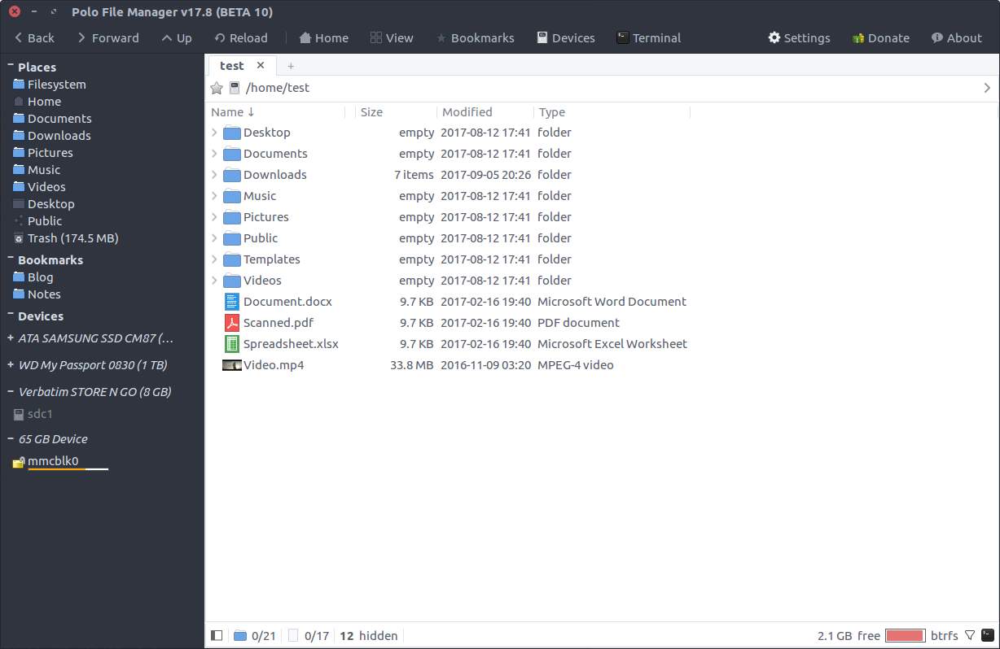
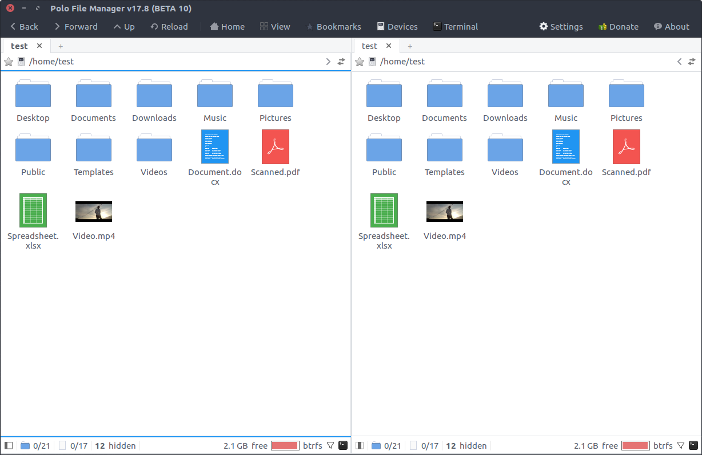
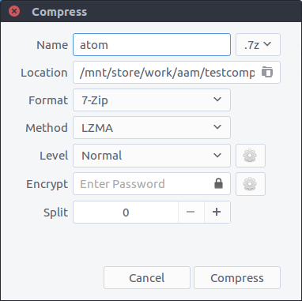
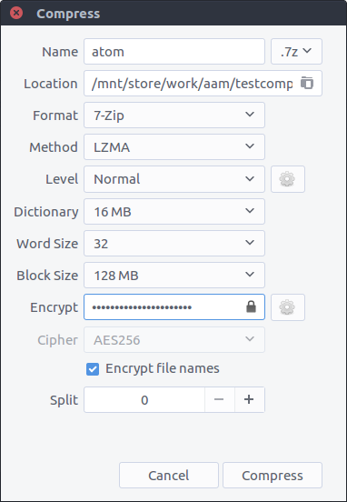
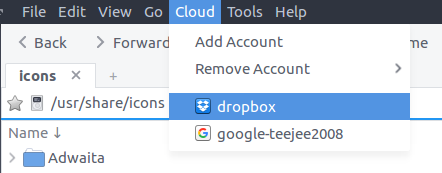

## Polo File Manager

Polo is a modern, light-weight file manager for Linux with support for multiple panes and tabs; support for archives, and much more.

## **Features**

- **Multiple Panes** - Single-pane, dual-pane (vertical or horizontal split) and quad-pane layouts. Supports multiple tabs in each pane. Each tab has an embedded terminal which can be toggled with the F4 key.
- **Multiple Views** - List view, Icon view, Tiled view and Media view.
- **Device Manager** - Devices popup displays list of connected devices with options to mount and unmount. Supports locking/unlocking LUKS encrypted devices.
- **Archive Support** - Support for browsing archives as normal folders. Supports creation of archives in multiple formats with advanced compression settings.
- **PDF Actions** - Actions in right-click menu: Split and Merge pages, Add or Remove Password, Rotate, etc.
- **ISO Actions** - Actions in right-click menu: Mount, Boot in VM, Write to USB
- **Image Actions** - Actions in right-click menu: Rotate, Resize, Reduce Quality, Optimize PNG, Convert to other formats, Boot or Reduce Colors, etc.
- **Checksum & Hashing** - Actions in right-click menu to generate MD5, SHA1, SHA2-256 ad SHA2-512 checksums for file and folders. Double-click on files with  **.md5, .sha1, .sha2, .sha256, .sha512** extensions to verify.
- **Video Downloads** - Paste URLs from YouTube and other video websites in a folder to download video files. Integrates with youtube-dl utility.

## Screenshots

*Single-pane layout with Sidebar and IconView*


*Single-pane layout with Sidebar and ListView*



*Dual-pane layout with IconView*



*Dual-pane layout with ListView*


*Options for creating archives - Supports all encoder options, encryption, and split archives*

   


*Support for browsing cloud storage accounts*




## Installation

PPA and DEB files are available for Ubuntu and Ubuntu-based distributions. Binary installers are available for all Linux distributions.

**[Installation](https://github.com/teejee2008/polo/wiki/Installation)**

## Donation Plugins

Polo includes a few extra plugins for people who have contributed to the project through donations, translations, etc. You can make a donation for $10 or more via PayPal to receive the plugins by email. Your contributions will help keep the project alive and support future development.

[**Donation Features**](https://github.com/teejee2008/polo/wiki/Donation-Features)

**PayPal** ~ If you find this application useful and wish to say thanks, you can buy me a coffee by making a one-time donation with Paypal. 

[](https://www.paypal.com/cgi-bin/webscr?business=teejeetech@gmail.com&cmd=_xclick&currency_code=USD&amount=10&item_name=Polo%20Donation)  

**Patreon** ~ You can also sign up as a sponsor on Patreon.com. As a patron you will get access to beta releases of new applications that I'm working on. You will also get news and updates about new features that are not published elsewhere.

[](https://www.patreon.com/bePatron?u=3059450)

**Bitcoin** ~ You can send bitcoins at this address or by scanning the QR code below:

```1Js5vfgmwKew4byF9unWacwAjBQVvZ3Fev```

